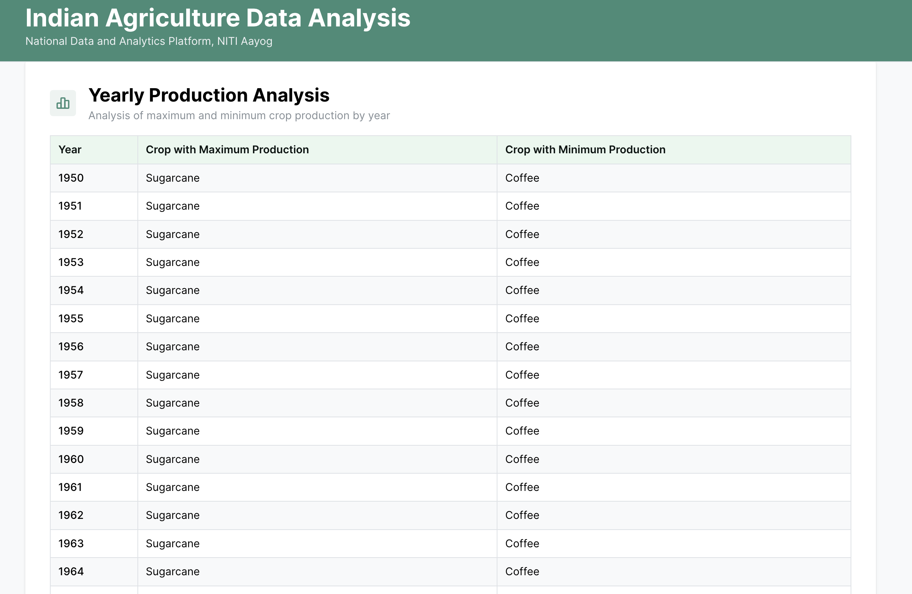
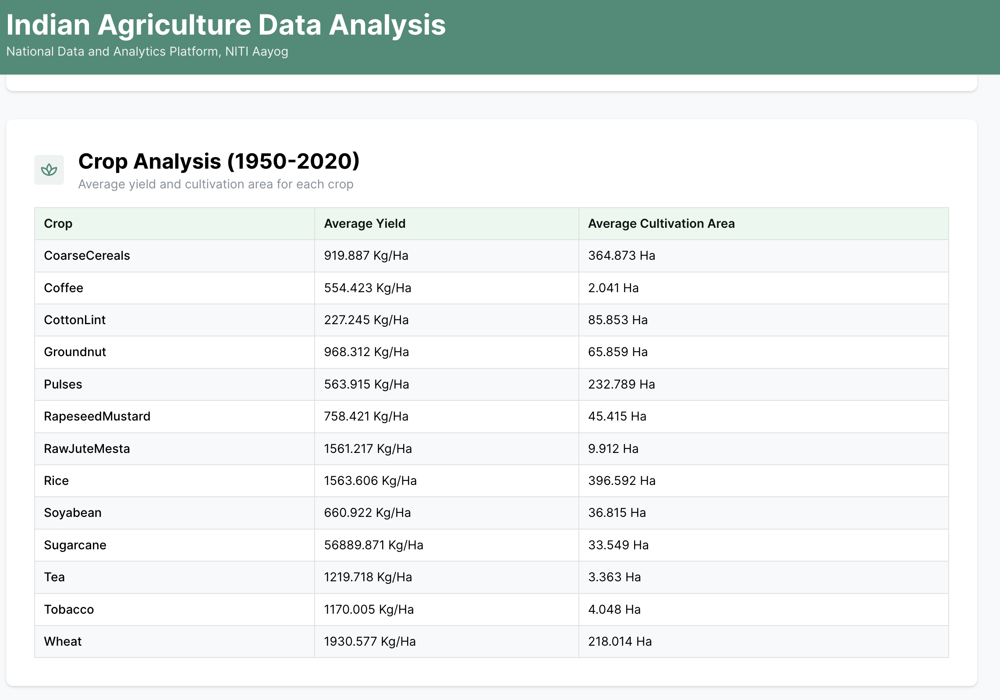

# Indian Agriculture Data Analysis

This project analyzes Indian Agriculture dataset provided by National Data and Analytics Platform, NITI Aayog.

## Setup Instructions

1. Clone the repository
2. Install dependencies:
   ```bash
   yarn install
   ```
3. Run the development server:
   ```bash
   yarn dev
   ```

## Screenshots

[Add a screenshot of the Yearly Analysis Table here]


[Add a screenshot of the Crop Analysis Table here]


## Features

1. Yearly Analysis Table showing:
   - Year
   - Crop with Maximum Production
   - Crop with Minimum Production

2. Crop Analysis Table showing:
   - Crop name
   - Average Yield between 1950-2020
   - Average Cultivation Area between 1950-2020

## Tech Stack

- TypeScript
- Vite
- Mantine v7
- React

## Project Structure

```
src/
├── components/     # React components
│   ├── Layout/    # Layout components like AppShell
│   └── Tables/    # Table components
├── types/         # TypeScript interfaces
├── utils/         # Data analysis utilities
│   ├── dataAnalysis.ts    # Analysis functions
│   └── dataTransform.ts   # Data transformation utilities
├── hooks/         # Custom React hooks
└── data/          # Dataset
```

## Implementation Details

- All calculations are optimized for performance using Map data structures
- Values are rounded to 3 decimal places
- Missing values in the dataset are treated as 0
- No external libraries besides Mantine v7 are used for UI components

## Data Processing

1. **Data Transformation**
   - Raw data is transformed into a structured format
   - Year extraction from "Financial Year (Apr - Mar), YYYY" format
   - Empty values are converted to 0

2. **Yearly Analysis**
   - Groups data by year
   - Calculates maximum and minimum production crops
   - Time complexity: O(n) where n is the number of records

3. **Crop Analysis**
   - Calculates average yield and cultivation area
   - Uses efficient Map data structure for grouping
   - Time complexity: O(n) where n is the number of records

## Code Quality

- TypeScript for type safety
- Modular component structure
- Efficient data processing algorithms
- Clean and maintainable code structure
- Comprehensive comments for complex logic
- Consistent code formatting

## Performance Considerations

- Memoized calculations using React's useMemo
- Efficient data structures (Map) for lookups
- Single pass data processing where possible
- Optimized component rendering

## Future Improvements

1. Add data visualization using charts
2. Implement data filtering options
3. Add export functionality for analyzed data
4. Implement data caching for better performance
5. Add unit tests for data analysis functions

## License

MIT

## Author

@Parv-gugnani